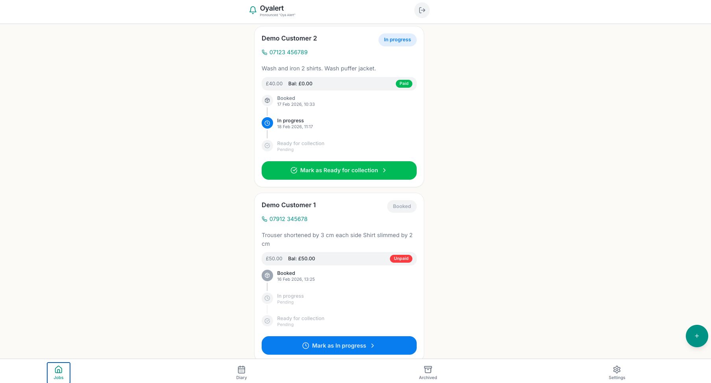
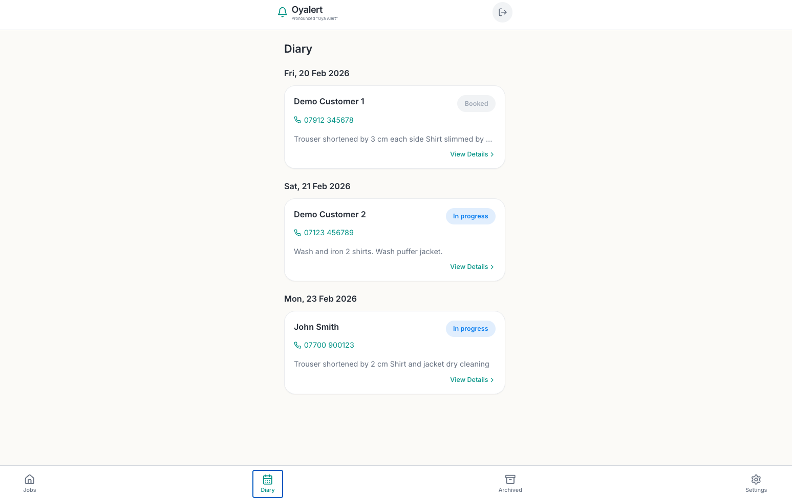
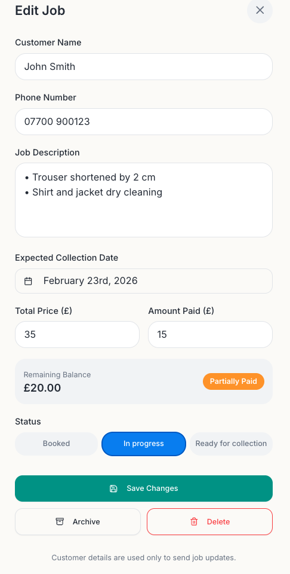
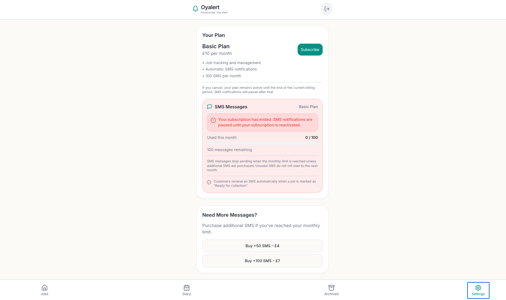

# Oyalert – Job Tracking SaaS

SaaS job tracking and SMS notification platform for small service businesses, designed with structured data modelling, lifecycle tracking and subscription billing logic.

## Technical Summary

Oyalert is a web-based SaaS application built using Lovable Cloud (Supabase-powered infrastructure), with a relational data model and structured workflow logic. The system enforces staged job lifecycle transitions, derived payment status fields and subscription-based feature gating for SMS notifications to maintain data consistency.

## Problem Motivation

The idea for Oyalert came from observing how small service businesses often lose structured tracking when operating independently.

A local tailor previously worked in a shop that used automated SMS alerts to notify customers when items were ready. After opening his own shop, that system was no longer available. Job tracking became informal and there were no reminders.

As a customer, I once forgot to collect altered clothes because there was no notification system in place, and the tailor had no structured way to track outstanding collections.

This highlighted a common operational gap:

- No structured job lifecycle tracking

- No automated customer reminders

- Limited visibility over job status

Oyalert was built to introduce simple structure and automated notifications for sole traders.

## Core Features

- Create and manage customer jobs

- Multi-stage job status tracking

- Timestamped status transitions

- SMS notification when job marked “Ready for collection”

- Subscription-based billing model (£10 per month)

- Monthly SMS usage tracking

## System Architecture

 ### Frontend

- Built using Lovable

- Web-based dashboard interface

 ### Backend

- Managed cloud backend via Lovable Cloud (Supabase-powered infrastructure)

- Relational database with per-user data isolation

- Built-in authentication and subscription state handling

 ### Billing

- Stripe subscription integration

- Restricted API keys with scoped permissions

- Recurring monthly billing

- Subscription status controls SMS activation

### External Services

- SMS provider integration layer

## Simplified Data Model

Users

- id

- email

- business_name

- business_type

- created_at

Jobs

- id

- user_id (foreign key)

- customer_name

- customer_phone

- description

- status

- created_at

- in_progress_at

- ready_at

- collected_at

Subscriptions

- user_id

- stripe_customer_id

- stripe_subscription_id

- status

- current_period_start

- current_period_end

## Key Technical Decisions

- Implemented staged job lifecycle instead of a single status button

- Stored timestamps for each stage to enable interval tracking

- Scoped Stripe restricted API key permissions for security

- Linked subscription status to SMS activation logic

- Designed onboarding to capture structured business metadata

## Testing and Configuration

- Stripe sandbox environment used for subscription testing

- Restricted API keys configured with minimal required permissions

- Authentication error handling improved for clarity

- Subscription state validated before enabling SMS

## Project Status

Live web application with active subscription billing.
Currently iterating on onboarding, billing logic and workflow improvements.

## Payment Tracking Enhancement

The job model was extended to include structured financial tracking fields:

- total_price

- amount_paid

- remaining_balance (derived field)

- payment_status (derived field)

## Business Logic

Payment status is calculated automatically:

- If amount_paid = 0 → Unpaid

- If 0 < amount_paid < total_price → Partially Paid

- If amount_paid ≥ total_price → Fully Paid

This prevents manual status errors and ensures financial tracking is derived from numeric values rather than user selection.

## Design Decision

Payment status is not manually editable.
It is derived from financial values to maintain data consistency.

This improves:

- Accuracy

- Auditability

- Workflow reliability

## Screenshots

### Jobs Dashboard

### Diary View

### Job Edit & Payment Logic

### Subscription Model

